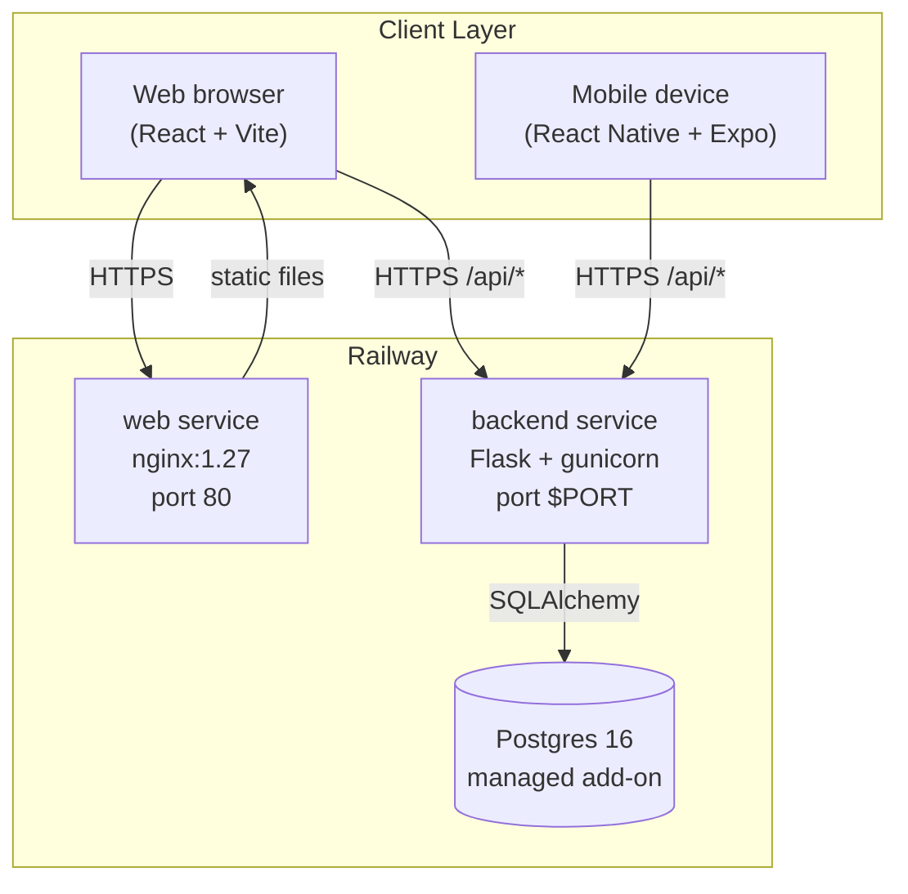
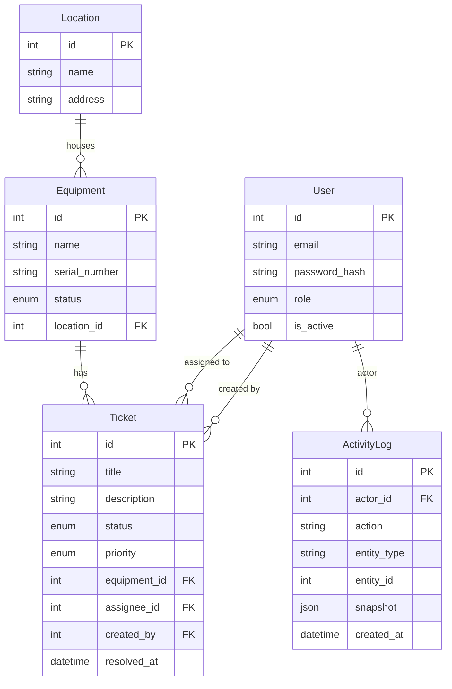

# OpsTrack — Architecture

## Service diagram



## Request flow — web frontend

```
Browser → nginx (static bundle) → React app boots
Browser → POST /api/auth/login → Flask → Postgres → JWT pair
Browser → GET /api/equipment (Authorization: Bearer <token>) → Flask → Postgres → JSON
         ↳ 401 Unauthorized → Axios interceptor → POST /api/auth/refresh → new token → retry
```

## Request flow — mobile

```
Expo app → AsyncStorage.getItem('access_token')
         → GET /api/tickets → Flask → 401
         → AsyncStorage.getItem('refresh_token')
         → POST /api/auth/refresh → new token saved to AsyncStorage → retry
```

## Data model



## Auth design

- **Access token** — short-lived JWT (default 60 min), sent as `Authorization: Bearer <token>`.
- **Refresh token** — long-lived JWT (default 30 days), sent as `Authorization: Bearer <token>` to `POST /api/auth/refresh`.
- **Silent refresh** — both the web Axios interceptor and the mobile client queue in-flight requests during a refresh to avoid duplicate refresh calls.
- **Roles** — `admin`, `staff`. Role is embedded in the JWT claims; resource handlers check `get_jwt()["role"]`.

## Directory layout

```
ops/
├── backend/                Flask API
│   ├── app/
│   │   ├── __init__.py     create_app factory
│   │   ├── config.py       Dev / Test / Prod configs
│   │   ├── extensions.py   db, migrate, jwt, cors singletons
│   │   ├── errors.py       global error handlers
│   │   ├── activity.py     SQLAlchemy flush hooks → ActivityLog
│   │   ├── cli.py          flask opstrack seed
│   │   ├── models/         SQLAlchemy mapped models
│   │   └── resources/      Flask-RESTful resource classes
│   ├── migrations/         Alembic migration scripts
│   ├── tests/              pytest suite
│   ├── Dockerfile
│   └── railway.toml
│
├── web/                    React + Vite admin dashboard
│   ├── src/
│   │   ├── api/            Axios client + interceptors
│   │   ├── components/     Shared UI (Modal, Layout, Skeleton, …)
│   │   ├── context/        AuthContext (token state + refresh logic)
│   │   └── pages/          Route-level components
│   ├── Dockerfile          Multi-stage: node build → nginx serve
│   └── railway.toml
│
├── mobile/                 React Native + Expo field app
│   ├── src/
│   │   ├── api/            AsyncStorage-backed Axios client
│   │   ├── screens/        Login, Equipment, Tickets, Activity
│   │   └── navigation/     Bottom tab + stack navigator
│   └── App.jsx             Entry — gesture-handler import first
│
├── docker/
│   └── docker-compose.yml  Local dev stack (db + backend + web)
│
├── docs/
│   ├── architecture.md     ← this file
│   └── deployment.md       Railway deploy guide
│
├── Makefile                Developer shortcuts
└── .github/workflows/
    └── ci.yml              Lint + test + (optional) Railway deploy
```

## CI/CD

```
push / PR
    │
    ├── backend-lint   ruff check app tests
    ├── backend-test   pytest (Postgres service container)
    └── web-build      eslint + vite build

push to main (all three pass)
    │
    ├── deploy-backend   railway up --service backend
    └── deploy-web       railway up --service web
```

See [deployment.md](deployment.md) for Railway setup and the note in `.github/workflows/ci.yml` about enabling the deploy jobs.
